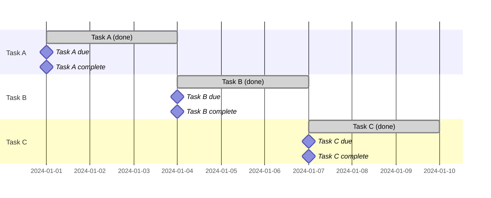
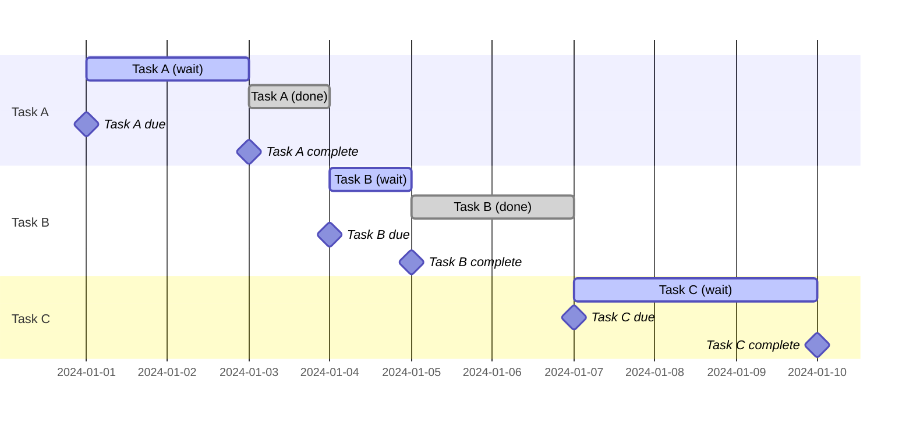
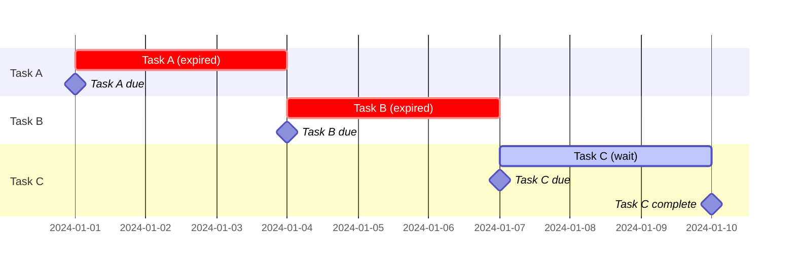
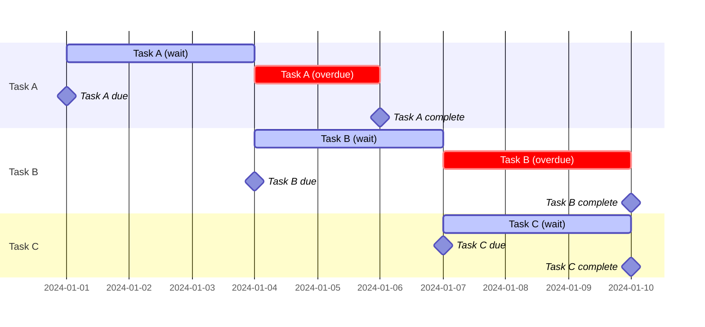
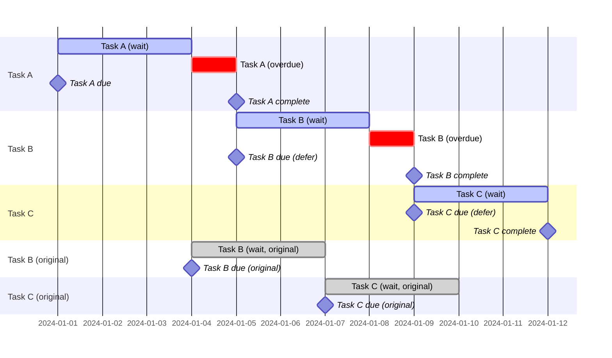
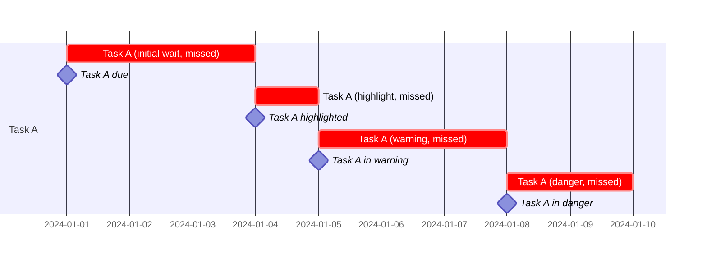
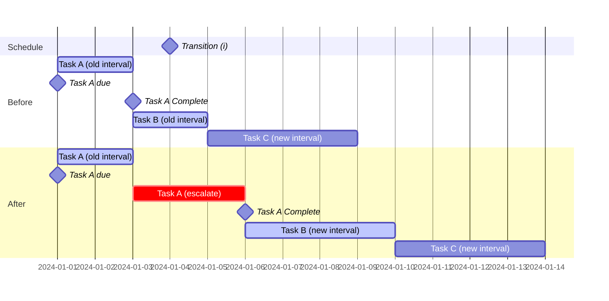
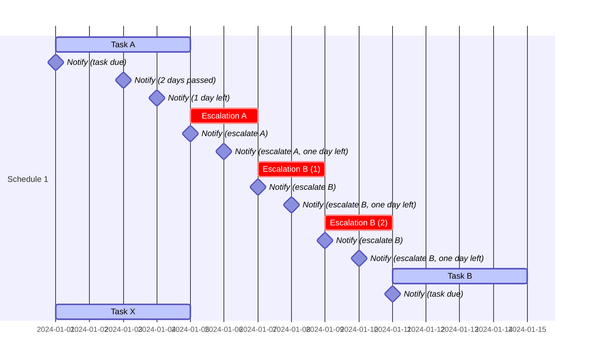
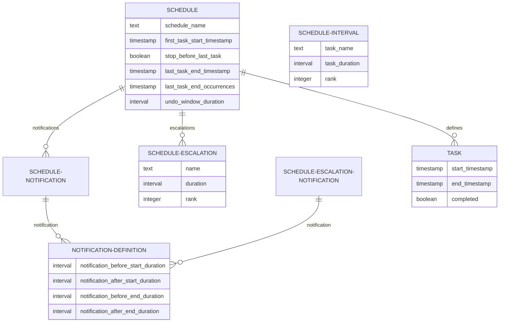

# Epochrony
A recurring task scheduling service.

## Introduction & use cases
This library covers a number of use cases where a task needs to be repeated.
For each use case, 3 tasks (`A`, `B` and `C`) that need to be completed every 3 days are used as examples and visualised with
Gantt charts.
In use cases where tasks are not completed on time, tasks `A`  and `B` indicated delayed tasks and task `C` is completed on time.

### Ideal user behaviour
Ideally, recurring tasks that must be completed within a time window are completed immediately as they become due.
> Note that the completion date of tasks `A`, `B` and `C` are on the same day as the due date in the diagram below.

### Actual user behaviour
In real-world scenarios, tasks are likely to be delayed beyond due dates.
In the simple case where tasks are completed within an allowed time window, this may look like the following.
Note how for each task `A`, `B` and `C`, the completion date is after the due date, but before the start of the next task.
Task `A` is completed 2 days after becoming due, and task `B` is completed 1 day after becoming due.

Some tasks may become overdue and depending on the nature of the task, may either be:
- `expired`: the task is dropped in place of a future recurring task, or
- `extended`: the task must still be completed, but the effect on the next occurrence may be:
  - `ignored`: the original start of the next task is kept so the tasks overlap, or
  - `deferred`: the start of the next task will wait until the current task is complete

These scenarios are visualised as follows.

#### Overdue task expires
If a task expires after the end date has passed and becomes overdue, it is dropped and can no longer be completed.
New tasks replace the expired tasks on the expected schedule.
In the following example, tasks `A` and `B` are missed, but `C` is completed.

#### Overdue task extends but does not affect next occurrence
In this use case, the task (`A`) is allowed to be completed after the start of the next occurrence of the task (`B`).
The different tasks may either be:
  - `Independent`: tasks can be completed in any order, e.g. due task `B` can be completed before overdue task `A`
  - `Ordered`: task `B` cannot be completed until task `A` has been completed, task `C` cannot be completed until task `B` has been completed, etc.

#### Overdue task extends and defers next occurrence
In this use case, the task (`A`) is allowed to be completed after the scheduled start of the next occurrence of the task (`B`), but the next task (`B`) does not become due until the first task is complete.
> The original start dates (had there been no overdue delay) for tasks `B` and `C` are shown at the end of the chart. Note the extended axis compared to previous examples as the 2-day delay for tasks `A` and `B` accumulate to push out the due date of task `C`.

## Task configuration
This section details how a task can be configured for the above use cases.
A single task is presented in the examples.
### Escalation
A previous use case allowed tasks to become overdue.
This is a single escalation.
A task may be configured to have multiple escalations of varying durations.
Escalations attributes are customisable.
In the example below, task `A` should initially be completed in a 3-day window.
If this is not completed within 3 days, then:
- the task should be escalated to `highlight`
- After 1 day in the `highlight` state, the task should be escalated to `warning`
- after 3 days in the `warning` state, the task should be escalated to `danger`

The last escalation may optionally:
- expire
- repeat indefinitely
- extend indefinitely

### Mutation
A schedule may mutate multiple times over time either by:
- `occurrences` after some number of iterations of the task
- `interval` after a fixed interval from the previous task
- `timestamp` after a fixed point in time
- `cron` on a repeating expression

#### Interval mutation
In this mutation, the schedule may either extend or contract.
In the example below, Schedule `1` initially defines tasks that must be completed every 2 days.
After a fixed timestamp on `2024-01-04`, subsequent tasks transition to 4 days.
There are two scenarios, where the user completes the task:
- before the transition
- after the transition

The user completes task `A` on the last allowable day, starting the beginning of task `B`.

### Dependency
A schedule may depend on another schedule in the following ways:
- `occurrences` after some number of iterations of tasks in schedule 1, a task in schedule 2 starts
- `interval` after a period of time after schedule 1 has started, schedule 2 starts

### Grouping

When tasks start or are escalated, a user may need to notified.

### Undo
Allow a completed task to be marked as incomplete within a specified time window.

## Complete example
The following example covers the following scenarios:
- Multiple schedules
  - Schedule 1 defines a recurring 4-day task (A, B)
  - Schedule 2 defines a 6-day task (X, Y)
- Escalations
  - Schedule 1 defines 2 2-day escalations, with the last escalation extending infinitely
- Mutations
  - Schedule 1 extends
  <!-- - Schedule 2 defines a 1 2-day escalation, with the last escalation -->
- Dependent schedules
  - Schedule 2
- Expiry
- Variable intervals
- Notifications grouping

## Entities and relationships
This section describes the entities that are used to define tasks as well as those created by user interactions.

> Note that attribute definitions follow [PostgreSQL data types](https://www.postgresql.org/docs/current/datatype.html)

